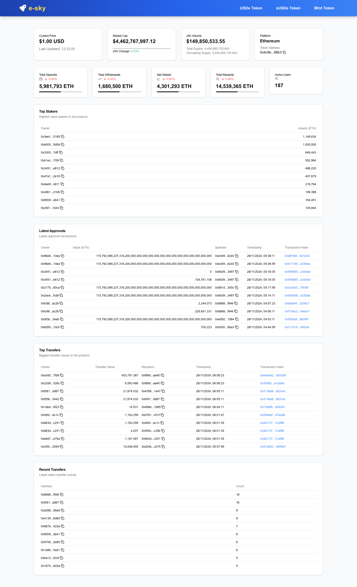

# e-sky

**e-sky** is a blockchain explorer built for **USDe tokens** in the **Ethena ecosystem**. This project leverages **Goldsky** for indexing blockchain data, offering real-time tracking and management of **USDe** token transactions, transfers, staking, and rewards.

**[https://e-sky.xyz](https://e-sky.xyz)**

**[YouTube Demo](https://www.youtube.com/watch?v=zYaYiLQ-cmQ)**

---

## About USDe and Ethena Labs

### **What is USDe?**

**USDe** is a fully collateralized and algorithmic stablecoin created by **Ethena Labs**. Its value is pegged to the US Dollar, making it a critical asset in the Ethena ecosystem. USDe aims to provide decentralized, efficient, and reliable financial tools for users, enabling them to:

- Perform seamless transactions.
- Stake and earn rewards.
- Participate in DeFi applications.

USDe is deployed on the Ethereum blockchain and supports a broad range of financial activities within the ecosystem.

### **Ethena Labs**

**Ethena Labs** is a pioneering blockchain company focusing on decentralized stablecoins and financial systems. Their mission is to provide robust, algorithmically-backed financial instruments to power the decentralized finance (DeFi) sector. With **USDe** as a flagship product, Ethena Labs has introduced innovative solutions like staking mechanisms, minting processes, and high-performance liquidity tools, which are integrated into **e-sky**.

Key offerings of **Ethena Labs** include:

- **USDe Minting and Collateralization**: Ensures stability and reliability.
- **sUSDe Staking**: A mechanism for users to stake their USDe tokens and earn passive income.
- **DeFi Integration**: Seamlessly integrates USDe into the broader DeFi landscape.

Learn more about Ethena Labs: [Ethena Labs Official Website](https://ethenalabs.com)

---

## Features

- **USDe Token Exploration**: View transactions, transfers, approvals, and ownership transfers.
- **Staking Management**: Manage and track **sUSDe** tokens, including deposits, withdrawals, and rewards.
- **Real-time Data Indexing**: Powered by **Goldsky** for fast and efficient blockchain data retrieval.
- **Transaction History**: View detailed transaction logs, with filtering and search functionality.
- **Responsive UI**: Optimized for both desktop and mobile platforms.
- **Beneficiaries**: Track users or contracts that benefit from token minting, staking, or other reward mechanisms.
- **Benefactors**: Monitor users or contracts that provide tokens, such as those who mint tokens or contribute to the staking pools.
- **Current Price Card**: Displays the real-time price of **USDe** tokens fetched from CoinMarketCap API.
- **Market Cap Card**: Provides the total market capitalization of **USDe** tokens.
- **24h Volume Card**: Shows the daily trading volume for **USDe** tokens.

## Table of Contents

- [Installation](#installation)
- [Usage](#usage)
- [Project Structure](#project-structure)
- [Technologies Used](#technologies-used)
- [Screenshots](#Screenshots)
- [Contributing](#contributing)
- [License](#license)
- [Contact](#contact)

## Installation

### Prerequisites

- **Node.js** (LTS version)
- **Yarn** or **npm**

### Steps to Run Locally

1. **Clone the Repository**:

   ```bash
   git clone https://github.com/noah-sheldon/e-sky.git
   ```

2. **Navigate to the Project Directory**:

   ```bash
   cd e-sky
   ```

3. **Install Dependencies**:

   Using **Yarn**:

   ```bash
   yarn install
   ```

   Using **npm**:

   ```bash
   npm install
   ```

4. **Steps to Set Environment Variables**

   5. Create a new file named `.env.local` in the root of your project directory.
   6. Copy the structure from `.env.example` into your `.env.local` file.
   7. Fill in the necessary values for the variables:

   ```bash
   NEXT_PUBLIC_USDE_MAINNET_SUBGRAPH_URI=YOUR_MAINNET_SUBGRAPH_URI
   NEXT_PUBLIC_USDE_STAKE_SUBGRAPH_URI=YOUR_STAKE_SUBGRAPH_URI
   NEXT_PUBLIC_USDE_MINT_SUBGRAPH_URI=YOUR_MINT_SUBGRAPH_URI
   COINMARKETCAP_API_KEY=YOUR_COINMARKETCAP_API_KEY
   COINMARKETCAP_BASE_URL=YOUR_COINMARKETCAP_BASE_URL
   ```

5. **Run the Development Server**:

   Using **Yarn**:

   ```bash
   yarn dev
   ```

   Using **npm**:

   ```bash
   npm run dev
   ```

6. **Access the Application**:
   Open your browser and navigate to [http://localhost:3000](http://localhost:3000).

## Usage

### Key Pages & Features

- **Dashboard**: View an overview of **USDe** tokens, including transaction history and staking rewards.
- **USDe Token Management**: Explore transactions, transfers, and approvals related to **USDe**.
- **Staking**: Track **sUSDe** token deposits, withdrawals, and rewards.
- **Transaction History**: View a detailed list of transactions for each **USDe** token.
- **Minting**: View minted **USDe** tokens, track minting events, and monitor **Beneficiaries** and **Benefactors** of minted tokens.

## Technologies Used

- **Frontend**:

  - **Next.js** (React framework)
  - **Tailwind CSS** (Styling)
  - **Radix UI** (UI Components)
  - **React Query** (Data Fetching)
  - **JavaScript** (Static typing)

- **Backend**:

  - **GraphQL** (Query Subgraph)
  - **JavaScript** (API Support)
  - **Goldsky** (Blockchain Data Indexing)
  - **CoinMarketCap API** (External API for price, market cap, and volume)
  - **Vercel** (Deployment)

- **Blockchain**:

  - **USDe Tokens** (Ethena ecosystem)

---

## How USDe, Ethena Labs, and Goldsky are Used

### **USDe in the App**

- **Token Management**: View and manage USDe token transactions, transfers, and ownership changes.
- **Minting & Staking**: Perform minting operations and stake USDe tokens to earn rewards.
- **Financial Insights**: Monitor market data like price, market cap, and trading volume for USDe tokens.

### **Ethena Labs Integration**

- **Staking Mechanism**: Ethena's sUSDe staking system allows users to deposit USDe and earn rewards.
- **Stablecoin Management**: Ensures that the app reflects the latest functionality for collateralized and algorithmically backed USDe tokens.

### **Goldsky Usage**

- **Blockchain Indexing**: Goldsky's indexing service powers real-time data retrieval for transactions, staking, and transfers.
- **Graph Queries**: Enables efficient filtering and display of blockchain data.

---

## Screenshots

Below are the screenshots of various features in the **e-sky** application:

### Home Dashboard



### Minting


### Withdrawals


### Deposits


### Transfers


### Architecture


## Contributing

We welcome contributions to **e-sky**! To contribute, follow these steps:

1. **Fork** the repository.
2. **Create a new branch** for your feature (`git checkout -b feature-name`).
3. **Commit** your changes (`git commit -am 'Add new feature'`).
4. **Push** to your branch (`git push origin feature-name`).
5. **Create a Pull Request** with your changes.

Make sure to follow our [contribution guidelines](CONTRIBUTING.md).

## License

This project is licensed under the **MIT License**. See the [LICENSE](LICENSE) file for details.

## Contact

For questions or support, feel free to contact us:

- [Noah Sheldon](https://www.linkedin.com/in/noah--sheldon/)
- [GitHub](https://github.com/noah-sheldon/e-sky)
- [X](https://x.com/noah__sheldon/)

```

```
